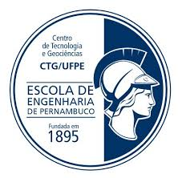

# Laboratorio-de-Sensores-e-Instrumentacao(LSI)
Repositório para códigos e arquivos de projeto referentes ao reflectômetro automatizado. 
Aqui estão códigos para ESP32 DevKit V1 escritos em framework Arduino para módulo de aquisição e controle do reflectômetro automatizado do LSI. 
Estão aqui os códigos separados por aquisição, movimento 2D, rotação e emulador para envio de dados.
Um código em python denominado ESP 32 - Datalogger é utilizado para gerar um arquivo com dados provenientes da serial. 
**Projeto desenvolvido no Laboratório de Sensores e Instrumentação do Departamento de Eletrônica e Sistemas da UFPE.** 
 
 
**Laboratory of Sensors and Instrumentation** 
Repository for codes and design files for the automated reflectometer. 
Here are the codes for ESP32 written in Arduino framework for LSI's automated reflectometer acquisition and control module. 
The codes are separated by acquisition, 2D movement, rotation and an emulator, for sending simulated data. 
A python code called ESP 32 - Datalogger is used to generate a file with data from the serial. 
**Project developed in the Laboratory of Sensors and Instrumentation under the Department of Electronics and Systems from UFPE.** 
       
